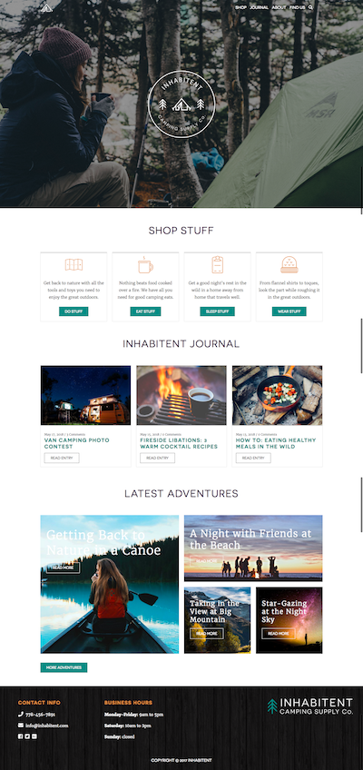
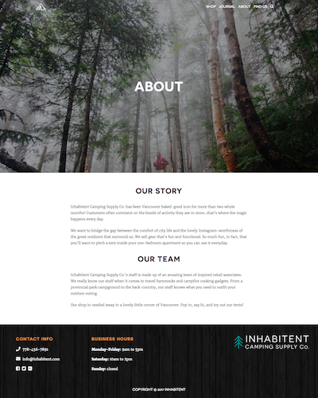

# Project Title

Inhabitent

## Description

A project I completed during the Web Developer program at RED Academy  
A Wordpress theme for an outdoor-store featuring custom posttypes, custom taxonomies and archives.

## Built With

* HTML5
* CSS3
* jQuery
* Wordpress
* PHP
* MySQL
* Apache

## Screenshots

